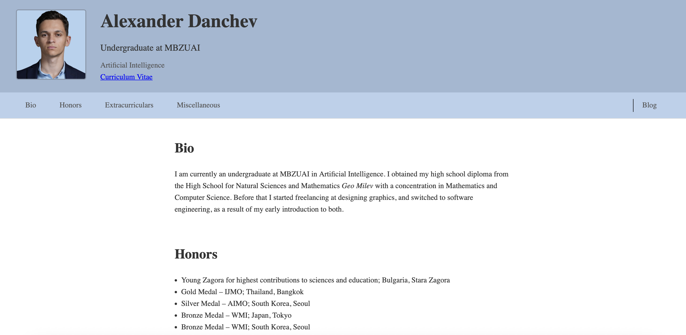
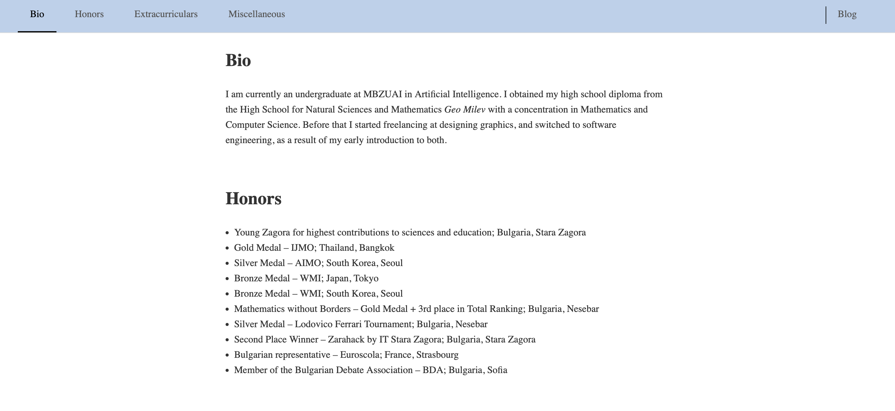
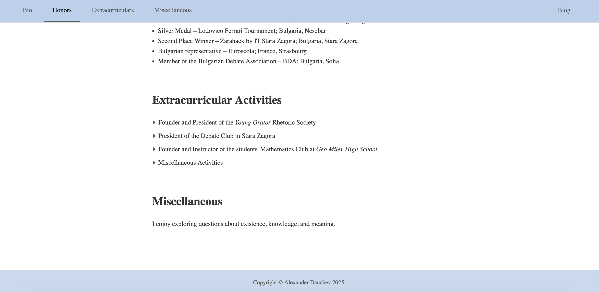

## Access
https://danchevkz.github.io/index.html

---

## Overview
This is a personal homepage. It is aimed at peers, prospective collaborators, and anyone interested in my background and work. The goal is to establish credibility, provide background, and serve as a hub for further content (e.g. blog, CV). The site shows honors, extracurriculars, miscellaneous achievements -- things that support credibility. The blog section allows for ongoing updates that I plan to do at some point in the future.

---

## Screenshots
Landing hero with status card and portrait

Bio and Honors

Extracurriculars, Misc, and Footer

---

## Navigation and Structure
From index.html, which acts as a landing page, the main navigation links are CV, Bio, Honors, Extracurriculars, Miscellaneous, and a Blog.

- Header -- Profile photo, title, institution, and link to a downloadable CV.
- Navigation Bar -- Sticky links to all main sections plus a Blog link.

Sections:
- Bio (#bio) -- Educational background and brief academic journey.
- Honors (#honors) -- List of medals, awards, and representative distinctions.
- Extracurriculars (#extracurricular) -- Expandable sections for major initiatives and organizations led or joined.
- Miscellaneous (#misc) -- Personal interests.
- Footer -- Copyright notice with dynamic year.

---

## Design Choices
- Lightweight, no frameworks or libraries.
- Minimal JavaScript for interactivity.
- Fully client-side, optimized for GitHub Pages.

The site is partitioned into distinct categories: bio, honors, extras, etc. This allows a visitor to jump to the part they care about. There is minimal decoration, making the focus on the information. I chose a blueish color scheme that I keep consistent through the entire page. I included a CV to give a formal record of my milestones, and a Bio for more a more informal introduction. I separated honors to highlight my awards, and extracurriculars to show my activities outside academics. I added a Misc section, which I plan to update later, and the case is similar for the Blog.

---

## Credits  
- **Author:** Alexander Danchev  
- **Hosting:** [GitHub Pages](https://pages.github.com/)  
- **Inspiration:** Based on minimalist personal portfolio layouts from Stanford faculty.
